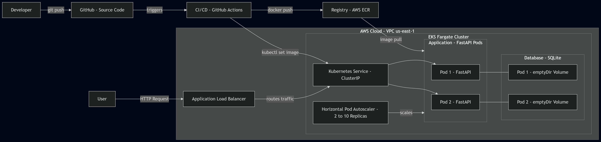

# Cloud Info Service

## Architecture Diagram

## Deployment Instructions

### Provision 

Make sure you have:

AWS CLI (version 2.x or higher)

Terraform (version 1.0 or higher)

kubectl (Kubernetes command-line tool)

Helm (Kubernetes package manager, version 3.x)

Docker (for local testing, optional)

An AWS account with administrator access

1. Clone the repo

`git clone https://github.com/t0uch9r455/cloud-info-service`

`cd cloud-info-service`

2. Configure AWS

`aws configure`

3. Initialize Terraform

`cd terraform`
`terraform init`
`terraform apply -auto-approve`

4. Configure kubectl to connect to your cluster

`aws eks update-kubeconfig --name cloud-info-cluster --region us-east-1`

verify with:

`kubectl get nodes`

5. Add the AWS Load Balancer Controller Helm repository

`helm repo add eks https://aws.github.io/eks-charts`
`helm repo update`

6. Install the AWS Load Balancer Controller

`helm install aws-load-balancer-controller eks/aws-load-balancer-controller -n kube-system --set clusterName=cloud-info-cluster --set serviceAccount.create=false --set serviceAccount.name=aws-load-balancer-controller `

7. Verify the controller is running

`kubectl get deployment aws-load-balancer-controller -n kube-system`

### Deploy application

1. Apply all Kubernetes manifests

`kubectl apply -f k8s/`

`kubectl apply -f hpa.yaml`

2. Wait for the ALB to provision

`kubectl get ingress cloud-info -w`

3. Verify the deployment is healthy

`export ALB_URL=$(kubectl get ingress cloud-info -o jsonpath='{.status.loadBalancer.ingress[0].hostname}')`

`curl http://${ALB_URL}/health`

`curl http://${ALB_URL}/metrics`

`curl http://${ALB_URL}/items`

### Destroy infrastructure

1. Remove all Kubernetes resources

`kubectl delete -f k8s/ --namespace=default --ignore-not-found`

`kubectl delete horizontalpodautoscaler cloud-info-service-hpa --namespace=default --ignore-not-found`

2. Uninstall the Load Balancer Controller

`helm delete aws-load-balancer-controller -n kube-system`

3. Destroy all Terraform-managed resources

`cd terraform/`

`terraform destroy -auto-approve`

4. Verify teardown is complete

`aws eks list-clusters --region us-east-1`

`cloud-info-cluster should not appear`

`aws ecr describe-repositories --region us-east-1`

`cloud-info-service repository should not appear`

## Tradeoffs

### Why you chose your tech stack

AWS EKS was selected because it can run Kubernetes workloads on Fargate without provisioning or managing EC2 worker nodes. This removes routine node work like operating system patching, capacity planning, and configuring cluster autoscaling. It keeps the lab focused on Kubernetes skills and workload design instead of server administration.

AWS Load Balancer Controller with an Application Load Balancer was selected because it integrates directly with EKS. It also includes key production features such as path-based routing, health checks, and CloudWatch metrics without extra setup.

GitHub Actions was chosen for CI/CD because it works natively within the GitHub platform, requires no extra infrastructure, and offers a free tier that fully supports this project. Each push to the main branch automatically runs linting, builds and tags the image, pushes it to the registry, and deploys the update.

Terraform was selected as the Infrastructure as Code tool because it is widely used across the industry and uses readable configuration files that make it easy to review and maintain.

### What you simplified

The main one was using SQLite with an emptyDir volume instead of a managed database. SQLite requires no setup or external dependencies and allows us to do CRUD operations without the overhead of RDS or IAM configuration. The tradeoff is that data is lost when a pod restarts, which is fine for a lab but not for production use.

The application was deployed behind a public Application Load Balancer instead of a private one with a VPN or bastion host. This setup makes it easy to verify the deployment by directly curling the endpoint.

The cluster was deployed in a single region across two availability zones instead of using a full multi‑region active‑passive setup. This approach cut provisioning time from about 25 minutes to 10 while still showing key concepts like subnet isolation, NAT gateway setup, and Fargate profile management across multiple availability zones.

### What you would improve with more time

The most valuable upgrade would be replacing SQLite with RDS Aurora Serverless v2. Aurora Serverless scales automatically from near zero to handle production traffic, provides multi-AZ replication for reliability, and integrates with AWS Secrets Manager for secure credential management. This change would turn the data layer from a simple lab setup into a production-ready solution without needing any always-on database instances.

Another improvement would be introducing a GitOps workflow with ArgoCD. The current CI/CD pipeline deploys directly to the cluster using kubectl, which works but lacks drift detection, audit tracking, and quick rollback options. ArgoCD treats the Git repository as the single source of truth and automatically keeps the cluster in sync with it, making configuration management, rollbacks, and team onboarding much simpler and more reliable.

From a security standpoint, the application would benefit from enabling HTTPS with ACM certificates and adding AWS WAF rules. The current setup uses HTTP on port 80, which is acceptable for a demo but not appropriate for production environments handling real data. Adding a certificate and WAF protection against common OWASP Top 10 threats would make the deployment much more secure and production-ready.

## AI Usage Disclosure

### What AI tools you used

I used Claude as my technical assistant mainly for debugging and implementing certain infrastructure features and issues. It was not used to generate the project upfront but rather helped with validating architectural decisions and troubleshooting specific failures or looking for best practices.

### What parts were AI-generated

Most of the AI assistance in this project was used for debugging and generating boilerplate code. Claude helped identify a CoreDNS issue where pods stayed in a Pending state because the Fargate admission webhook was not updating the scheduler name. The problem was that it used “default-scheduler” instead of “fargate-scheduler,” which caused DNS to fail across the cluster. Finding this quickly saved a lot of time that would have been spent troubleshooting.

Claude helped create reference examples for the GitHub Actions CI/CD workflow, the HPA manifest and the Prometheus middleware in main.py. The Terraform file was mostly written in advance, but AI assistance helped fix an ordering issue where private subnets were referenced before being declared. The README, including the tradeoffs and deployment sections, was organized with AI guidance, while the content itself reflected real implementation choices made during the project.

The application code was written independently. The Dockerfile and all python files were written independently. AI was consulted to make sure the build followed best practices.

### How you validated outputs

All AI-generated content was tested and verified before being added to the repository. No suggestions were accepted without being run locally first. The Terraform configuration was checked using terraform plan to review the resource graph, and terraform apply was executed twice during the project to confirm full reproducibility. The CI/CD pipeline was validated through several GitHub Actions runs, and any failures were reviewed and fixed manually until it produced consistent, successful deployments.

The Kubernetes setup was tested with kubectl describe, kubectl logs, and kubectl exec to make sure pods ran as non-root, limits were applied, probes worked, and the HPA controller was active. The app was checked by curling the live ALB URL to verify that /health returned JSON, /metrics showed valid Prometheus data, and /items saved and read data from SQLite. All testing was done on the live cluster to confirm the deployment worked as it would in production.

